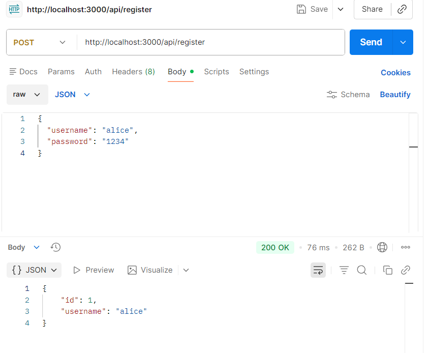
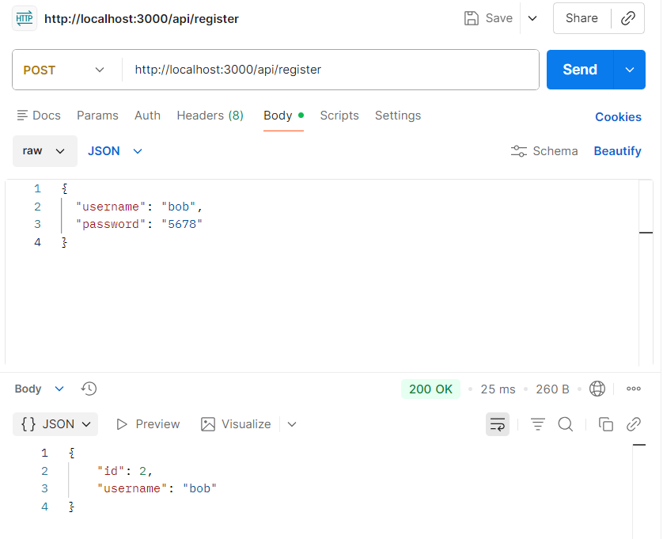
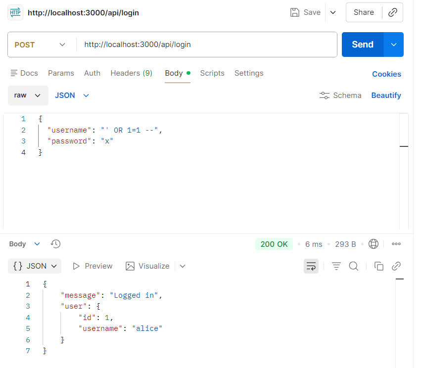
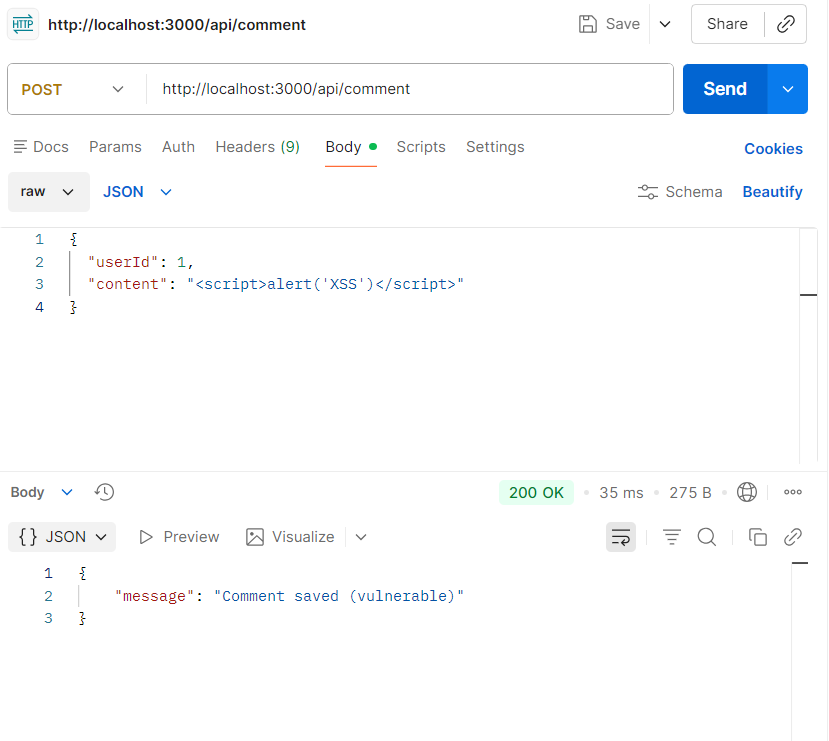
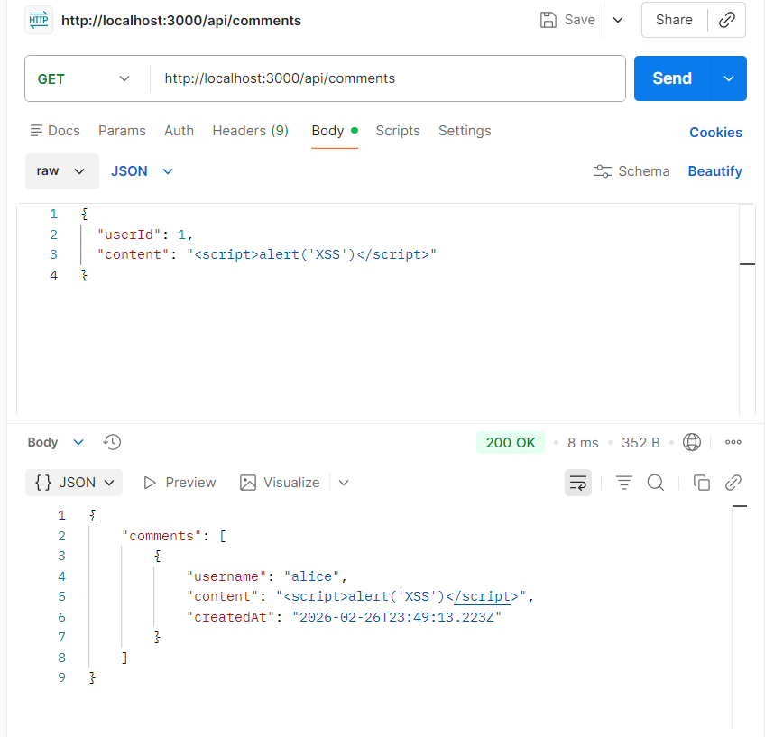

# Attacks Demonstration (Vulnerable Version)

This document explains how to reproduce the security vulnerabilities
using the vulnerable backend branch.

Switch to:

    git checkout feat/backend-vuln

Make sure the backend is running on:

http://localhost:3000

---

# 1️⃣ SQL Injection – Login Bypass

## Where is the bug?

In the vulnerable version, the login query is constructed using string concatenation
instead of parameterized queries.

This allows attackers to inject malicious SQL into the query.

## Attack Steps

Endpoint:
POST /api/login

Body (raw → JSON):

    {
      "username": "' OR 1=1 --",
      "password": "x"
    }

## Expected Result

Login succeeds without valid credentials.

The backend returns a valid authenticated session.

## Security Impact

- Authentication bypass  
- Unauthorized system access  
- Potential full account compromise  

## Screenshot (Vulnerable)

---

# 2️⃣ Broken Access Control (IDOR) – Score Tampering

## Where is the bug?

The vulnerable version trusts the `userId` received from the client request
without verifying ownership or session identity.

This allows one user to modify another user’s score.

## Attack Steps

1. Login as Alice.
2. Send:

POST /api/score

    {
      "userId": 2,
      "score": 9999
    }

3. Verify using leaderboard endpoint.

## Expected Result

Bob’s score is modified to 9999.

## Security Impact

- Privilege escalation  
- Data integrity violation  
- Unauthorized data manipulation  

## Screenshot – Tampered Score

## Screenshot – Leaderboard Result

---

# 3️⃣ Stored XSS – Malicious Script Injection

## Where is the bug?

User input (comment content) is stored in the database
and rendered in the frontend using unsafe rendering (`innerHTML`).

No output encoding is applied before displaying user-controlled content.

## Attack Steps

POST /api/comment

    {
      "content": ""
    }

Then open the comments section in the frontend.

## Expected Result

The malicious script executes when comments are displayed.

## Security Impact

- Session hijacking  
- Account takeover  
- Arbitrary JavaScript execution  
- Website defacement  

## Screenshot – Payload Submission

## Screenshot – Stored Script in Comments

---

# Important

All the above attacks should FAIL when switching to:

    git checkout feat/backend-secure

This demonstrates the effectiveness of the implemented security fixes.